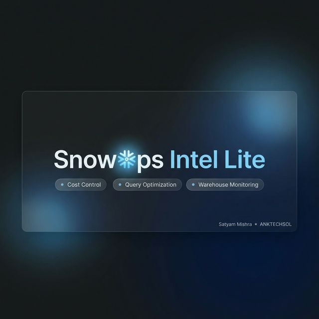
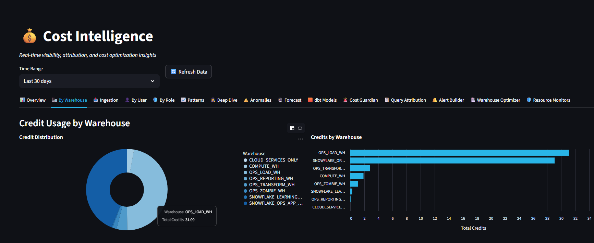
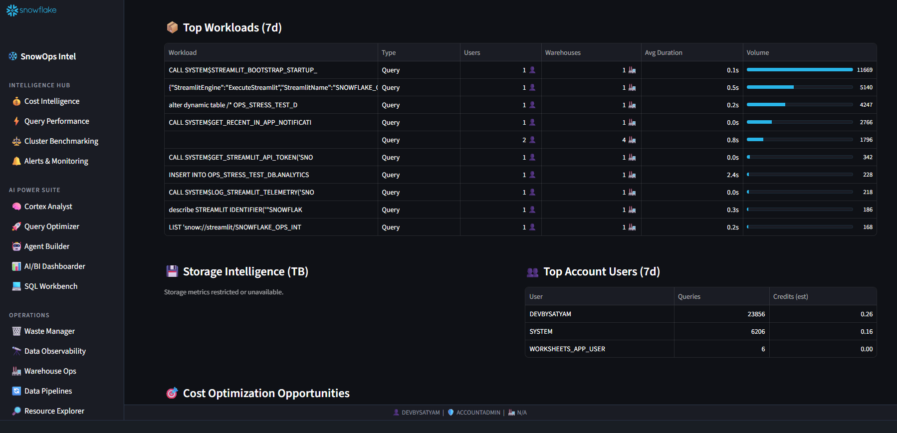
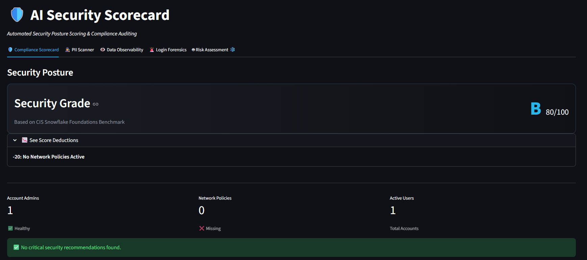
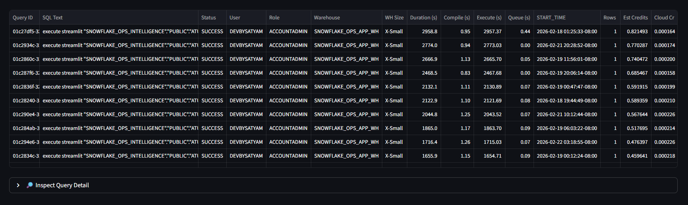
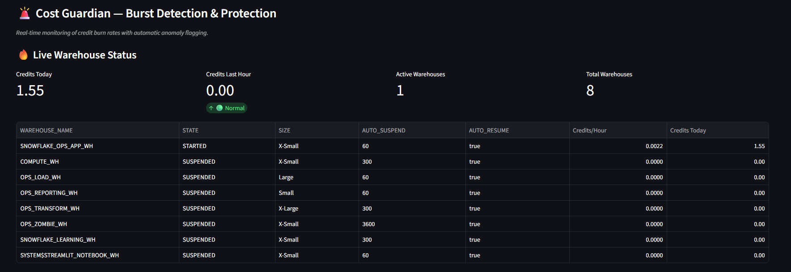
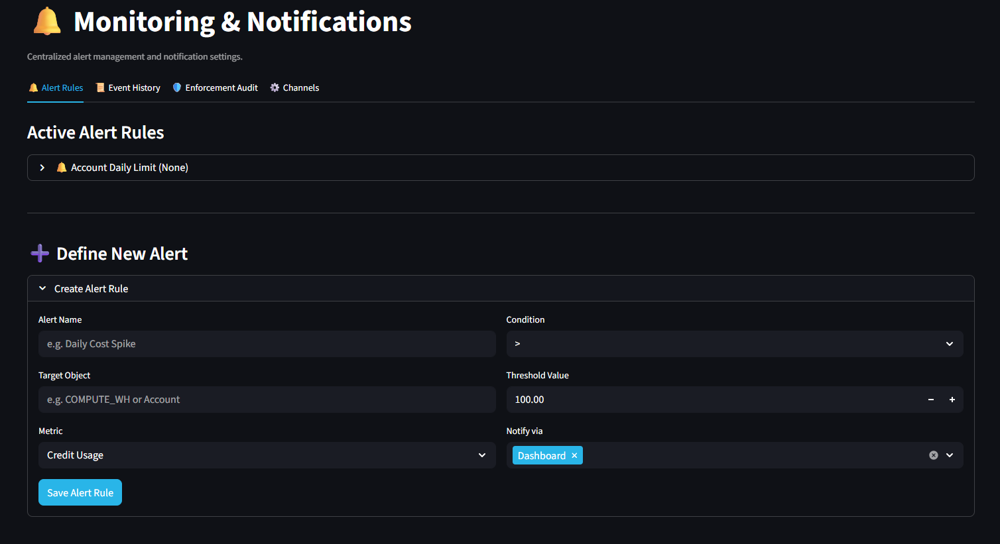

<div align="center">
  
  <h1>❄️ SnowOps Intelligence (Lite)</h1>
  
  <p><strong>Free, open-source Snowflake operations intelligence platform.</strong></p>

  <p>
    <a href="https://github.com/devbysatyam/snowops_intel_lite/issues"></a>
    <a href="https://github.com/devbysatyam/snowops_intel_lite/pulls"></a>
    <a href="https://github.com/devbysatyam/snowops_intel_lite/stargazers"></a>
    <a href="https://github.com/devbysatyam/snowops_intel_lite/network/members"></a>
    <a href="https://github.com/devbysatyam/snowops_intel_lite/blob/main/LICENSE"></a>
  </p>

  <p>
    <em>A powerful Streamlit-based application that runs entirely inside your Snowflake account with zero external infrastructure required. Manage costs, optimize queries, and monitor warehouses securely.</em>
  </p>
</div>

---

## ✨ Features Breakdown

SnowOps Intel Lite gives you 12 fully functional dashboards out-of-the-box:

### 💰 Cost Intelligence
* **Cost Overview**: Analyze daily burn rates, total credits consumed, and efficiency metrics across your account.
* **Warehouse Cost Breakdown**: Identify which compute clusters are consuming the most resources.
* **User & Role Attribution**: Track exactly which users and roles are driving your Snowflake bill.
* **Ingestion Cost Tracking**: Monitor Snowpipe, Copy, and Serverless ingestion costs.
* **Anomaly Detection**: Spot unusual spending spikes before they become billing surprises.
* **Cost Forecasting**: Predict your end-of-month bill based on current usage trajectories.

### ⚡ Query Intelligence
* **Query Performance Summary**: Identify bottlenecks and slow-running operations.
* **Expensive Workloads**: Find the specific queries that scan the most data and consume the most time.
* **Failed Queries**: Monitor failure rates to improve application stability.

### 🏭 Warehouse Monitoring
* **Status & Utilization**: See real-time cluster status, size, and uptime.
* **Performance Analysis**: Analyze cache-hit ratios and execution times per warehouse.

### 🔍 Data Observability
* **Cold Asset Detection**: Identify unused tables and schemas that are wasting storage costs.
* **Data Freshness Monitoring**: Ensure your critical datasets are updating as expected.

---


---

## 📸 Platform Gallery (Lite vs Pro)

<table align="center" style="width:100%; border-collapse: collapse; text-align:center;">
  <tr>
    <td style="padding: 10px; width: 50%;">
      <div style="background-color: #f8f9fa; padding: 10px; border-radius: 8px;">
        <h3 style="margin-top:0;">💸 Cost Intelligence <br><span style="color:#29B5E8; font-size: 0.8em; font-weight: bold; padding: 3px 8px; border: 1px solid #29B5E8; border-radius: 4px; display: inline-block; margin-top: 8px;">LITE EDITION</span></h3>
        
        <p style="font-size:0.9em; color:#555; margin-top: 10px;">Monitor complete cost breakdown, anomaly detection, and efficiency metrics.</p>
      </div>
    </td>
    <td style="padding: 10px; width: 50%;">
      <div style="background-color: #f8f9fa; padding: 10px; border-radius: 8px;">
        <h3 style="margin-top:0;">⚡ Query Optimization <br><span style="color:#29B5E8; font-size: 0.8em; font-weight: bold; padding: 3px 8px; border: 1px solid #29B5E8; border-radius: 4px; display: inline-block; margin-top: 8px;">LITE EDITION</span></h3>
        
        <p style="font-size:0.9em; color:#555; margin-top: 10px;">Identify slow queries, execution bottlenecks, and expensive workloads.</p>
      </div>
    </td>
  </tr>
  <tr>
    <td style="padding: 10px; width: 50%;">
      <div style="background-color: #f8f9fa; padding: 10px; border-radius: 8px;">
        <h3 style="margin-top:0;">🔍 Security Scorecard <br><span style="color:#800080; font-size: 0.8em; font-weight: bold; padding: 3px 8px; border: 1px solid #800080; border-radius: 4px; display: inline-block; margin-top: 8px;">PRO EDITION</span></h3>
        
        <p style="font-size:0.9em; color:#555; margin-top: 10px;">CIS benchmark scoring, automatic PII data scanning, and login forensics.</p>
      </div>
    </td>
    <td style="padding: 10px; width: 50%;">
      <div style="background-color: #f8f9fa; padding: 10px; border-radius: 8px;">
        <h3 style="margin-top:0;">🧠 Cortex AI Analyst <br><span style="color:#800080; font-size: 0.8em; font-weight: bold; padding: 3px 8px; border: 1px solid #800080; border-radius: 4px; display: inline-block; margin-top: 8px;">PRO EDITION</span></h3>
        
        <p style="font-size:0.9em; color:#555; margin-top: 10px;">Natural language queries and AI-driven automated SQL rewriting.</p>
      </div>
    </td>
  </tr>
  <tr>
    <td style="padding: 10px; width: 50%;">
      <div style="background-color: #f8f9fa; padding: 10px; border-radius: 8px;">
        <h3 style="margin-top:0;">🚨 Cost Guardian <br><span style="color:#800080; font-size: 0.8em; font-weight: bold; padding: 3px 8px; border: 1px solid #800080; border-radius: 4px; display: inline-block; margin-top: 8px;">PRO EDITION</span></h3>
        
        <p style="font-size:0.9em; color:#555; margin-top: 10px;">Real-time burst detection and automated warehouse protection.</p>
      </div>
    </td>
    <td style="padding: 10px; width: 50%;">
      <div style="background-color: #f8f9fa; padding: 10px; border-radius: 8px;">
        <h3 style="margin-top:0;">🏗️ Alert Builder <br><span style="color:#800080; font-size: 0.8em; font-weight: bold; padding: 3px 8px; border: 1px solid #800080; border-radius: 4px; display: inline-block; margin-top: 8px;">PRO EDITION</span></h3>
        
        <p style="font-size:0.9em; color:#555; margin-top: 10px;">Route metric anomalies automatically to Teams, Slack, or Webhooks.</p>
      </div>
    </td>
  </tr>
</table>

## 🚀 Getting Started (Deployment)

SnowOps Intel Lite is built to run as a native **Streamlit in Snowflake (SiS)** application. It takes less than 5 minutes to deploy.

### Option A: SQL-Only Deploy (Zero Clone, Recommended)

You can deploy the entire application directly from GitHub without cloning the repository or installing CLI tools.

1. Log into **Snowsight**.
2. Open a new **SQL Worksheet** and run the following to define your role:
   ```sql
   USE ROLE ACCOUNTADMIN;
   ```
3. Copy the contents of the [`setup_git_deploy_lite.sql` (found in the `setup` folder)](setup/setup_git_deploy_lite.sql) script.
4. Paste it into the worksheet and click **▶ Run All**.
   *(This script automatically creates the database, warehouse, GitHub integration, and deploys the Streamlit app.)*
5. Navigate to **Projects → Streamlit → SNOWOPS_INTEL_LITE**.

### Option B: Snow CLI Deploy

If you prefer local development tools, you can use the official Snow CLI.

1. **Clone the repository:**
   ```bash
   git clone https://github.com/devbysatyam/snowops_intel_lite.git
   cd snowops_intel_lite
   ```
2. **Run infrastructure setup in Snowsight:**
   Copy the contents of `setup/setup_lite.sql` and run it as `ACCOUNTADMIN` in Snowsight to create the tables.
3. **Deploy using Snow CLI:**
   ```bash
   snow streamlit deploy --replace --open
   ```

---

## 📖 How to Use

Once the app is running in Streamlit, you will see a comprehensive sidebar navigation panel.

1. **Cost Hub**: Start here. Review your overarching efficiency score. If it's below 80/100, use the sub-tabs (By User, By Role, Top Queries) to drill down into the inefficiency.
2. **Queries Hub**: Use the "Query ID Lookup" feature to safely analyze and format complex SQL directly in the interface. Review the "Failed" sub-tab daily to catch systemic issues early.
3. **Warehouse Hub**: Check the status tab to ensure dev/test warehouses aren't left running.
4. **Settings**: Adjust your `$ Cost Per Credit` setting so financial numbers accurately reflect your contract rate.

---

## 🔒 Security & Privacy (Telemetry)

This project respects your data privacy:
* **Zero Egress by Default**: The application code runs entirely inside your Snowflake perimeter.
* **Anonymous Telemetry**: The application optionally sends *anonymous* session pings (page views) to help us understand usage. 
* **NO Data Leaves**: We **NEVER** collect query text, query results, warehouse names, table names, usernames, or any financial/cost metric values.
* **Opt-Out Easily**: You can disable telemetry entirely with a single click in the **Settings → Telemetry** tab.

---

## ⚡ Upgrade to Pro

The Pro version of SnowOps Intelligence fundamentally changes how you manage Snowflake by introducing autonomous AI capabilities.

**Pro Features Include:**
* **Cortex AI Analyst**: Ask questions about your infrastructure in plain English.
* **Cost Guardian**: Real-time burst monitoring with automated warehouse suspension. 
* **Agent Builder**: Create custom autonomous agents that monitor and automatically fix issues.
* **Security & Governance**: Automated CIS Snowflake Benchmark scoring and PII detection.
* **AI Query Optimizer**: Get AI-generated rewritten SQL to instantly fix slow queries.
* **Alert Builder**: Route real-time metric thresholds to Slack, Teams, or PagerDuty.

👉 **[Discover SnowOps Intelligence Pro](https://snowops.anktechsol.com)**

---

## 🤝 Contributing (Issues & PRs)

We welcome the community! 

* **Found a bug?** Please submit an issue on the [GitHub Tracker](https://github.com/devbysatyam/snowflake_ops_intelligence/issues). Include screenshots and error traces if applicable.
* **Have a feature request?** Open a discussion issue.
* **Want to contribute?** We actively merge PRs. Please fork the repository, create a feature branch, and submit a Pull Request.

---
<div align="center">
  <sub>Built with 🩵 for the Snowflake Community by <a href="https://github.com/devbysatyam">@devbysatyam</a></sub>
</div>
